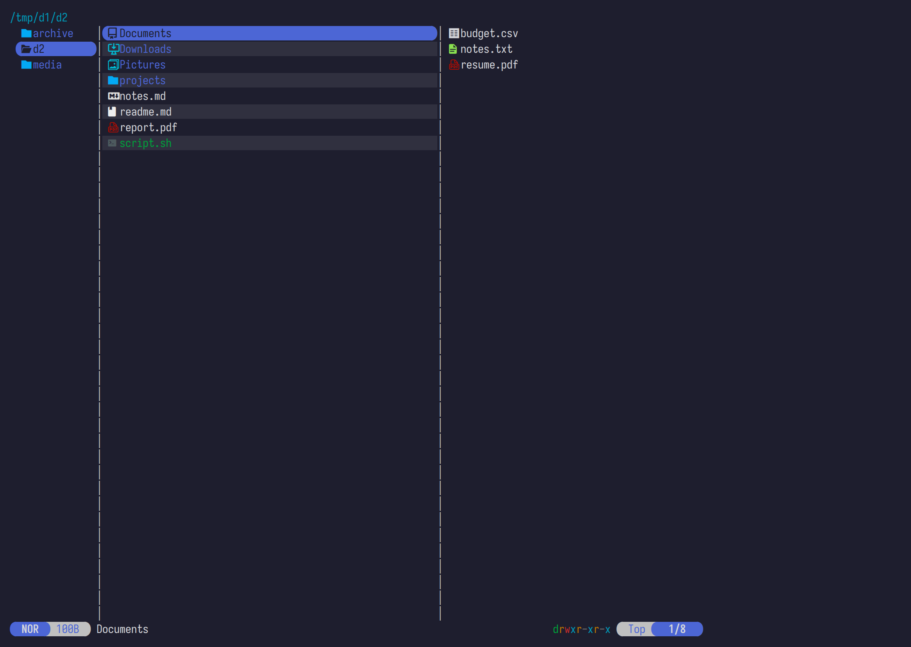
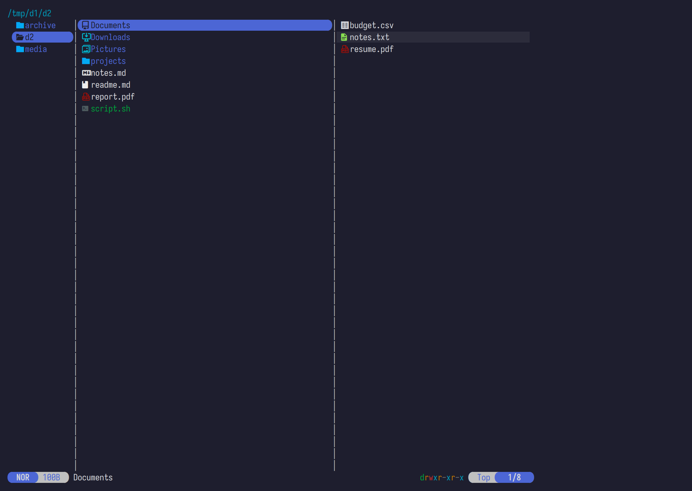

# zebra.yazi

Zebra-striped rows for [Yazi](https://github.com/sxyazi/yazi) — lighten or darken
alternate rows against your theme's background. Stock Yazi, no fork, no build.


## Install

```sh
git clone https://codeberg.org/jjpb/zebra.yazi \
  ~/.config/yazi/plugins/zebra.yazi
```

> `ya pkg` currently only installs from GitHub (hardcoded upstream), so a plain
> clone is the way until this repo is mirrored there.

Then add to `~/.config/yazi/init.lua`:

```lua
require("zebra"):setup({
  base = "#1e1e2e",                 -- your background color
  rows = { {}, { lighten = 0.03 } },
})
```

Restart Yazi.

**Where does `base` come from?** `base` is the color the stripes are derived
from. You can set it explicitly, or let the plugin pick it up from your theme —
see [Base](#base) below.

## Config

```lua
require("zebra"):setup({
  base    = "#1e1e2e",   -- background to derive stripes from (see Base)
  rows    = { ... },     -- default pattern for all panes
  current = { ... },     -- override for the current pane
  parent  = { ... },     -- override for the parent pane
  preview = { ... },     -- override for the preview pane
  panes   = {            -- hard on/off gates per pane
    parent = true, current = true, preview = true,
  },
  on_file = nil,         -- optional: function(file, default) -> style?
})
```

### Rows — the stripe pattern

`rows` is a list cycled by row index. Every entry is one row-slot in the
repeating pattern:

- `{}` — plain row, no stripe
- `{ lighten = 0.03 }` — background lightened by 3%
- `{ darken = 0.35 }` — background darkened by 35%
- `{ bg = "#3a3a5c" }` — absolute color, no blending
- entries also accept any `ui.Style` field: `fg`, `bold`, `italic`, …

Classic zebra (every other row):

```lua
rows = { {}, { lighten = 0.03 } },
```

Blocks of two striped rows of every four:

```lua
rows = { {}, {}, { lighten = 0.05 }, { lighten = 0.05 } },
```

| | |
|---|---|
|  |  |
| `lighten = 0.03` (subtle) | `darken = 0.35` |
|  |  |
| absolute `bg` (high contrast) | 2-of-4 pattern |

### Per-pane patterns

`current`, `parent` and `preview` override `rows` for that pane (empty or
missing → falls back to `rows`). `panes.*` hard-disables a pane regardless.

Stripes only in the current pane:

```lua
rows = {},
current = { {}, { lighten = 0.08 } },
```

Different pattern in the preview pane:

```lua
rows = { {}, { lighten = 0.03 } },
preview = { {}, {}, { lighten = 0.06 }, {} },
```

| | |
|---|---|
|  |  |
| `current` only | `preview` only |

### Per-directory rules

`dirs` maps a path pattern (Lua pattern, `~` expands) to `false` (stripes off)
or an override table. Rules match the listing directory of each pane and cover
subdirectories:

```lua
dirs = {
  ["~/dotfiles"] = false,                              -- off here and below
  [".*/mnt/remote/.*"] = false,                        -- pattern match
  ["*/projects/*"] = { current = { {}, { lighten = 0.06 } } },  -- different pattern
}
```

Override tables accept the same keys as `setup` (`rows`, `current`, `parent`,
`preview`, `panes`). First matching rule wins; a literal path also matches
exactly or as a path prefix.

### Runtime toggles

`toggle` flips stripes on/off globally; `toggle-pane` flips one pane. Bind them
in `keymap.toml`:

```toml
[[mgr.prepend_keymap]]
on = ["U", "z"]
run = "plugin zebra --sync toggle"
desc = "Toggle zebra stripes"

[[mgr.prepend_keymap]]
on = ["U", "p"]
run = "plugin zebra --sync toggle-pane preview"
desc = "Toggle preview stripes"
```

`toggle-pane` takes `current`, `parent` or `preview`. Toggle state is persisted
to `~/.local/state/yazi/zebra.state` and restored on the next start. Opt out
with `persist = false` in `setup()`; the configured pattern itself is preserved.

## Base

`darken`/`lighten` blend against `base`. The plugin resolves it in this order:

1. explicit `base = "#rrggbb"` in `setup()`
2. `[app] overall` in your `theme.toml`
3. `[app] overall` in the active flavor (`flavor.toml`)

If none is found, absolute-color entries still work, and `darken`/`lighten`
entries are skipped with a one-time notice.

## Priority

Stripes lose to everything Yazi already emphasizes — hovered row, selection,
marker pills keep their own styles. The stripe is a background underlay:

hovered > filetype/marker > stripe > plain.

## Extension

`on_file` lets you restyle per file — return a style to override the pattern,
or `default` to keep it. Anything you can express in Lua works (per-directory,
time-based, per-extension…):

```lua
require("zebra"):setup({
  base = "#1e1e2e",
  rows = { {}, { lighten = 0.03 } },
  on_file = function(file, default)
    if file.name == "DRAFT.md" then
      return ui.Style():fg("#ff0000")  -- flag drafts, no stripe
    end
    return default
  end,
})
```

## Limitations

- The leftmost marker column is rendered by a separate component and is not striped.
- Stripes anchor to the entry index, so they stay stable while scrolling.
- Yazi's own directory badge (the parent pane's cwd pill) is not striped.

## License

[MIT](LICENSE)
