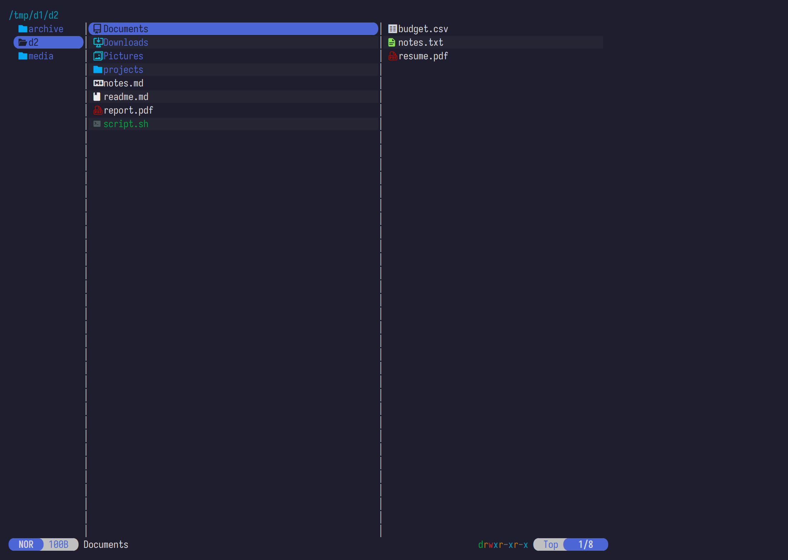
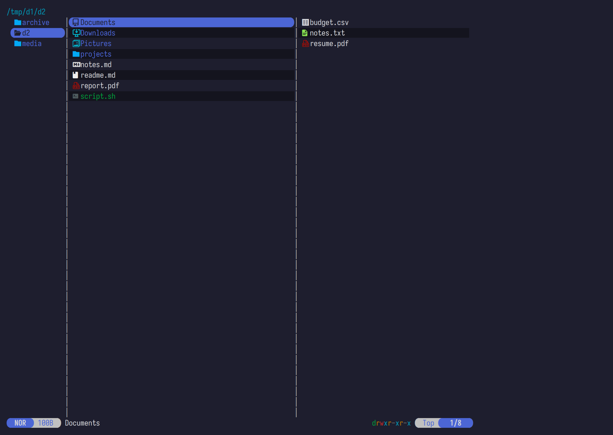
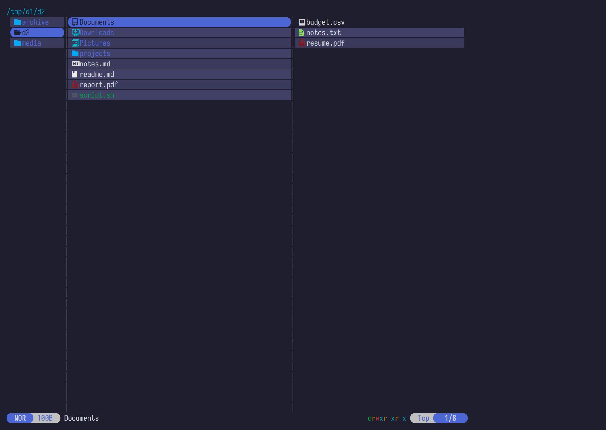
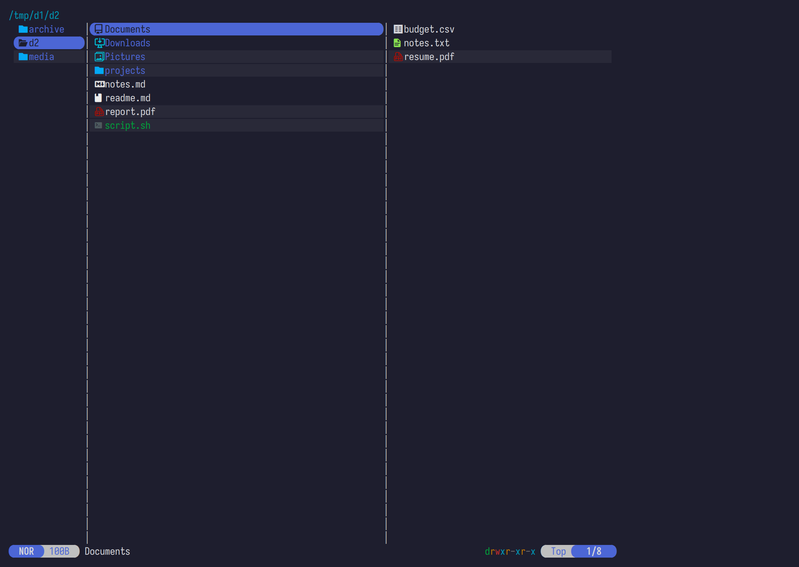

# zebra.yazi

Zebra-striped rows for [Yazi](https://github.com/sxyazi/yazi) — alternate row
backgrounds against your theme. Stock Yazi, no fork, no build. Pairs
naturally with [fage.yazi](https://github.com/jjpb44/fage.yazi).



## Install

```sh
ya pkg add jjpb44/zebra
```

or, equivalently:

```sh
git clone https://github.com/jjpb44/zebra.yazi \
  ~/.config/yazi/plugins/zebra.yazi
```

Then add to `~/.config/yazi/init.lua`:

```lua
require("zebra"):setup({
  base = "#1e1e2e",                 -- your background color
  rows = { {}, { lighten = 0.03 } },
})
```

Restart Yazi.

## Quick start

`rows` is a list cycled by row index. Every entry is one row-slot in the
repeating pattern:

| Entry                       | Effect                                 |
|-----------------------------|----------------------------------------|
| `{}`                        | plain row, no stripe                   |
| `{ lighten = 0.03 }`        | background lightened by 3%             |
| `{ darken  = 0.35 }`        | background darkened  by 35%            |
| `{ bg = "#3a3a5c" }`        | absolute color, no blending            |
| any `ui.Style` field        | `fg`, `bold`, `italic`, …              |

Classic zebra (every other row):

```lua
rows = { {}, { lighten = 0.03 } },
```

Blocks of two striped rows of every four:

```lua
rows = { {}, {}, { lighten = 0.05 }, { lighten = 0.05 } },
```

| | |
|---|---|
|  |  |
| `lighten = 0.03` (subtle) | `darken = 0.35` |
|  |  |
| absolute `bg` (high contrast) | 2-of-4 pattern |

## Config

```lua
require("zebra"):setup({
  base    = "#1e1e2e",
  rows    = { ... },     -- default pattern for all panes
  current = { ... },     -- override for the current pane
  parent  = { ... },     -- override for the parent pane
  preview = { ... },     -- override for the preview pane
  on_file = nil,         -- optional: function(file, default) -> style?
  enabled = true,        -- false = fully inert (see "Run only in some apps")
})
```

### Per-pane patterns

`current`, `parent`, `preview` override `rows` for that pane. Empty or
missing falls back to `rows`.

### Per-directory rules

`dirs` maps a path pattern (`~` expands, otherwise Lua pattern) to `false`
(stripes off) or an override table:

```lua
dirs = {
  ["~/dotfiles"]      = false,
  [".*/mnt/remote/.*"] = false,
  ["*/projects/*"]    = { current = { {}, { lighten = 0.06 } } },
}
```

First matching rule wins. A literal path also matches exactly or as a prefix.

## Toggle

```toml
[[mgr.prepend_keymap]]
on = ["U", "z"]
run = "plugin zebra --sync toggle"
desc = "Toggle zebra stripes"
```

State persists to `~/.local/state/yazi/zebra.state`. Opt out with
`persist = false` in `setup()`.

## Base

`darken` / `lighten` blend against `base`. Resolved in order:

1. explicit `base = "#rrggbb"` in `setup()`
2. `[app] overall` in your `theme.toml`
3. `[app] overall` in the active flavor (`flavor.toml`)
4. approximate: a typical dark (`#1e1e2e`) or light (`#e8e8e8`) background,
   chosen by the terminal's light/dark report

The exact terminal background is unobtainable from a plugin (yazi's spawned
processes have no controlling terminal), so step 4 is a best guess — stripes
appear and both blend directions stay visible, but pin `base` for exact
colors on themeless terminals.

## Run only in some apps

`enabled = false` makes the plugin fully inert (no styling, no state file, no
commands). Combine with an environment variable to gate it per launcher —
e.g. only when started from a desktop entry:

```ini
# yazi.desktop
Exec=env YAZI_STYLING=1 yazi
```

```lua
require("zebra"):setup({
  enabled = os.getenv("YAZI_STYLING") == "1",
  rows = { {}, { lighten = 0.03 } },
})
```

## Extension

`on_file` lets you restyle per file — return a style to override the pattern,
or `default` to keep it:

```lua
require("zebra"):setup({
  base = "#1e1e2e",
  rows = { {}, { lighten = 0.03 } },
  on_file = function(file, default)
    if file.name == "DRAFT.md" then
      return ui.Style():fg("#ff0000")
    end
    return default
  end,
})
```

## Priority

Stripes lose to everything Yazi emphasizes — hovered row, selection, marker
pills keep their own styles. The stripe is a background underlay:

```
hovered > filetype/marker > stripe > plain
```

## Troubleshooting

- **Toggling does nothing** — make sure your yazi session was started **after**
  the keymap / main.lua changed. Yazi reads both only at startup.
- **No stripes, but no error either** — check `~/.local/state/yazi/zebra.state`
  (delete it to reset). A stale `enabled=false` keeps the plugin disabled.
- **Stripes look slightly off, no theme installed** — the base is approximated
  from the terminal's light/dark report (see Base, step 4). Pin
  `base = "#rrggbb"` for exact colors.
- **Stripes everywhere including the directory badge** — that's the parent
  pane's cwd pill (Yazi's own component, not `Entity:style`). It's always
  unpainted, by design.

## Limitations

- The leftmost marker column is rendered by a separate component and is not
  striped.
- Stripes anchor to the entry index, so they stay stable while scrolling.
- Yazi's own directory badge (the parent pane's cwd pill) is not striped.

## License

[MIT](LICENSE)
